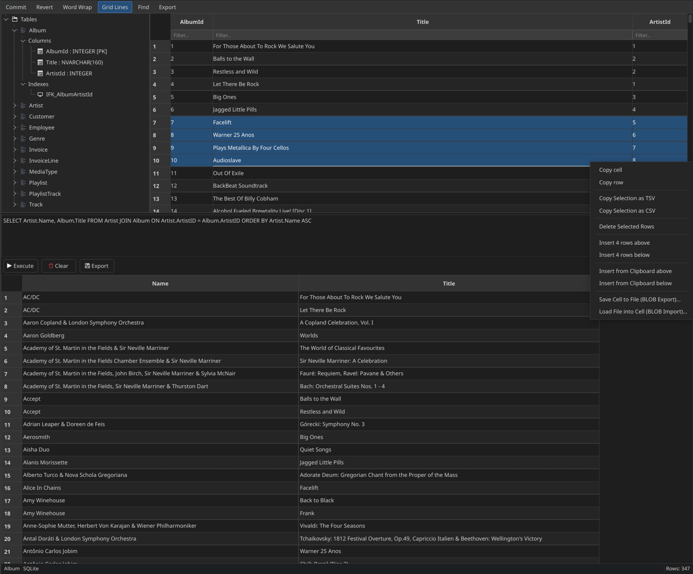

# dbview — Multi-Engine Database WLX Plugin



A Qt6 WLX (Lister) plugin for [Double Commander](https://doublecmd.github.io/) that views and edits database files: **SQLite**, **DuckDB**, **LevelDB**, **RocksDB**, **LMDB**, **Berkeley DB**, **Firebird Embedded**, **MS Access**, and **Apache Parquet**.

Built on the [`wlxbase_wlqt`](../wlxbase_wlqt/) platform library.

> [!WARNING]  
> **DATA MUTATION & LOCKING WARNING**  
> 
> By default, this plugin attempts to open databases in **read-write** mode to allow direct grid editing and data mutation.
> - **File Locking:** Opening a database with read-write privileges may lock the file, preventing other applications from writing to it.
> - **Concurrent Access Fallback:** If the database file is locked by another process, the plugin will silently fall back to **read-only** mode.
> - **Data Integrity:** Any edited cells must be explicitly committed using the **Commit** button (or `Ctrl+S` / `Ctrl+Shift+Z`) for relational databases, or are saved instantly for key-value stores. Handle write mode with care to prevent unintended database modifications.

---

## Features

### All Engines
- **Schema Navigation Tree:** Hierarchical tree panel on the left displaying Tables, Views, Columns (with data types, Primary/Foreign keys), and Indexes.
- **Find** (`Ctrl+F`) — search across all visible cells in the selected table.
- **Copy Selection** (`Ctrl+C`) — copy selected cell values as tab-separated values.
- **Word Wrap & Grid Lines** — toolbar actions to toggle wrapping and gridlines.
- **`GridMode::LiveDatabase`** — direct table mapping with minimal memory overhead.

### SQL Engines (SQLite, DuckDB, Firebird Embedded, Apache Parquet)
- **SQL Console:** A vertical split panel containing a query editor (with execution via `Ctrl+Return` or `Execute` button), results grid, and CSV/TSV results exporter.
- **Apache Parquet Proxying:** Opening a `.parquet`/`.pq` file initializes an in-memory DuckDB database and reads it via a virtual `read_parquet` view, making it SQL-queryable.
- **In-place Grid Editing:** Cells are editable, with modifications buffered.
- **Commit / Revert** (`Ctrl+S` / `Ctrl+Z` or `Ctrl+Shift+Z`) — commit or rollback pending changes.

### Key-Value & Non-Relational Engines (LevelDB, RocksDB, LMDB, Berkeley DB, MS Access)
- **Hidden SQL Console:** The SQL Console panel is automatically hidden as these engines do not support custom SQL.
- **Two-Column Grid:** Displays Key and Value columns.
- **Immediate Writing:** Key-value writes are saved instantly (no buffering).
- **Binary/BLOB Value Detection:** Non-UTF-8 values and large binaries display placeholder information `[Binary Data - X bytes]`.
- **Right-Click Context Menu Options:**
  - **Hex View Toggle:** Displays binary data as space-separated hex strings.
  - **BLOB Export ("Save Cell to File"):** Save raw binary values to any local file.
  - **BLOB Import ("Load File into Cell"):** Import binary files into a cell (available in write mode only).
- **Directory Detection (LevelDB/RocksDB):** Selecting a `.sst`/`.ldb`/`.log` file inside a LevelDB/RocksDB directory automatically targets the parent database directory.

---

## Keyboard Shortcuts

| Shortcut | Action |
|----------|--------|
| `Ctrl+S` | Commit changes (Relational engines only) |
| `Ctrl+Z` | Revert pending changes (Relational engines only) |
| `Ctrl+Shift+Z` | Alternative Commit/Redo shortcut |
| `Ctrl+Return` | Execute custom SQL query inside the SQL Console |
| `Ctrl+F` | Toggle Find panel |
| `Ctrl+C` | Copy selection |

---

## Engine Selection Logic

The factory (`DbEngine::createForFile()`) resolves the file type by extension and locks:

| Extension / File Pattern | Engine | SQL Console | Read-Only | Notes |
|-------------------------|--------|-------------|-----------|-------|
| `.sqlite`, `.sqlite3`, `.db`, `.db3` | SQLite | Yes | No* | QSQLITE driver connection |
| `.duckdb` | DuckDB | Yes | No* | C++ native client API |
| `.parquet`, `.pq` | DuckDB | Yes | No* | Virtual view via `read_parquet()` |
| `.fdb` | Firebird Embedded | Yes | No* | QIBASE SQL driver connection |
| `.mdb`, `.accdb` (if user table) | MS Access | No | **Yes** | Statically linked `libmdb` |
| `.lmdb`, `data.mdb` | LMDB | No | No* | C API client |
| `.bdb` | Berkeley DB | No | No* | C API with B-Tree cursors |
| `.ldb`, `.sst`, `.log` (if parent has `CURRENT`) | LevelDB | No | **Yes** | C++ API client via RocksDB (if compiled) |
| `.sst`, `.log` (fallback if LevelDB fails) | RocksDB | No | **Yes** | C++ API (if compiled) |

*\* Note: Opens as Read-Only automatically if the file lacks write permissions or if the database is currently locked by another process.*

---

## Building

### Prerequisites
- Qt6 (Core, Gui, Widgets, Sql)
- CMake ≥ 3.20
- Git (for FetchContent dependencies)
- Libraries: `liblmdb`, `libdb` (Berkeley DB), `libfbclient` (Firebird client)

### Compile
```bash
cd wlx/dbview
mkdir build && cd build
cmake ..
make -j$(nproc)
```

To enable support for **LevelDB** and **RocksDB**, you must compile with the `ENABLE_ROCKSDB_LEVELDB` flag set to `ON`. This flag is disabled by default because linking the RocksDB libraries increases the final `dbview_qt6.wlx` plugin size by over 12 MB. Both formats will be opened in strict read-only mode.

```bash
cmake .. -DENABLE_ROCKSDB_LEVELDB=ON
make -j$(nproc)
```

**Output:** `dbview_qt6.wlx` (shared library)

---

## Installation

Add `dbview_qt6.wlx` to your Double Commander plugins list.

**Default Detection String:**
```
EXT="DB" | EXT="SQLITE" | EXT="SQLITE3" | EXT="DB3" | EXT="DUCKDB" | EXT="LMDB" | EXT="BDB" | EXT="FDB" | EXT="MDB" | EXT="ACCDB" | EXT="PARQUET" | EXT="PQ"
```

**If compiled with `ENABLE_ROCKSDB_LEVELDB=ON`:**
Include the extensions for LevelDB and RocksDB:
```
EXT="DB" | EXT="SQLITE" | EXT="SQLITE3" | EXT="DB3" | EXT="DUCKDB" | EXT="LDB" | EXT="SST" | EXT="LOG" | EXT="LMDB" | EXT="BDB" | EXT="FDB" | EXT="MDB" | EXT="ACCDB" | EXT="PARQUET" | EXT="PQ"
```
