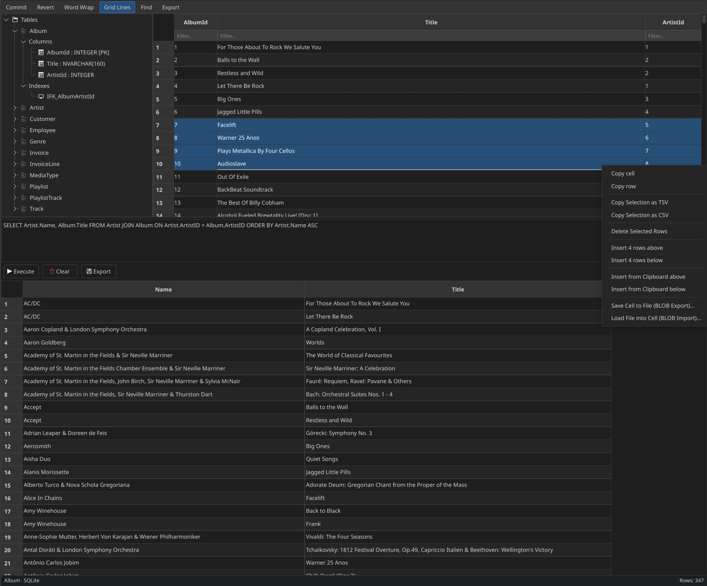

# dbview — Multi-Engine Database WLX Plugin



A WLX (Lister) plugin for [Double Commander](https://doublecmd.github.io/) that views and edits database files: **SQLite**, **DuckDB**, **LevelDB**, **RocksDB**, **LMDB**, **Berkeley DB**, **Firebird Embedded**, **MS Access**, and **Apache Parquet**.

This plugin ships as **two independent native builds** — one for DC's **GTK3** build, one for its **Qt6** build. Both share the same database-engine core (`src/core/`), but the GTK3 variant is noticeably narrower in scope — it has no SQL Console at all — see [Feature Differences](#feature-differences-gtk3-vs-qt6). Install whichever one matches your Double Commander build — they cannot be mixed.

> [!WARNING]  
> **DATA MUTATION & LOCKING WARNING**  
> 
> By default, this plugin attempts to open databases in **read-write** mode to allow direct grid editing and data mutation.
> - **File Locking:** Opening a database with read-write privileges may lock the file, preventing other applications from writing to it.
> - **Concurrent Access Fallback:** If the database file is locked by another process, the plugin will silently fall back to **read-only** mode.
> - **Buffered Edits:** All changes are buffered in memory and must be explicitly committed using the **Commit** button (`Ctrl+S` or `Ctrl+Shift+Z`). Uncommitted changes can be discarded with the **Revert** button (`Ctrl+Z`). Handle write mode with care to prevent unintended database modifications.

---

## Features (both variants, unless noted in Feature Differences)

### All Engines
- **Schema Navigation Tree:** Hierarchical tree panel on the left displaying Tables, Views, Columns (with data types, Primary/Foreign keys), and Indexes.
- **Find** (`Ctrl+F`) — search across all visible cells in the selected table.
- **Copy Selection** (`Ctrl+C`) — copy selected cell values as tab-separated values.
- **Word Wrap & Grid Lines** — toolbar actions to toggle wrapping and gridlines.
- **`GridMode::LiveDatabase`** — direct table mapping with minimal memory overhead.
- **Commit / Revert** (`Ctrl+S` / `Ctrl+Z` or `Ctrl+Shift+Z`) — commit or discard pending changes. Available on all writable engines.

### SQL Engines (SQLite, DuckDB, Firebird Embedded, Apache Parquet) — Qt6 only
- **SQL Console:** A vertical split panel containing a query editor (with execution via `Ctrl+Return` or `Execute` button), results grid, and CSV/TSV results exporter.
- **Apache Parquet Proxying:** Opening a `.parquet`/`.pq` file initializes an in-memory DuckDB database and reads it via a virtual `read_parquet` view, making it SQL-queryable.
- **In-place Grid Editing:** Cells are editable, with modifications buffered until committed.

### Key-Value & Non-Relational Engines (LevelDB, RocksDB, LMDB, Berkeley DB, MS Access)
- **Two-Column Grid:** Displays Key and Value columns.
- **Buffered Editing:** Value edits are buffered in memory until explicitly committed, consistent with SQL engines.
- **Binary/BLOB Value Detection:** Non-UTF-8 values and large binaries display placeholder information `[Binary Data - X bytes]`.
- **Right-Click Context Menu Options:**
  - **Hex View Toggle:** Displays binary data as space-separated hex strings.
  - **BLOB Export ("Save Cell to File"):** Save raw binary values to any local file.
  - **BLOB Import ("Load File into Cell"):** Import binary files into a cell (available in write mode only).
- **Directory Detection (LevelDB/RocksDB):** Selecting a `.sst`/`.ldb`/`.log` file inside a LevelDB/RocksDB directory automatically targets the parent database directory (Qt6 only — see below).

---

## Feature Differences (GTK3 vs Qt6)

| | GTK3 | Qt6 |
|---|---|---|
| SQL Console (SQLite/DuckDB/Firebird/Parquet) | **Not implemented** — no query editor, no arbitrary SQL execution, no results-grid export. Only the schema-driven table grid is available | Full SQL Console: query editor, `Ctrl+Return` execute, results grid, CSV/TSV export |
| Apache Parquet | Extension is detected and opened as a plain grid (via the shared DuckDB-backed engine core), but there is no SQL Console to actually query it beyond the default table view | Full support, including ad-hoc SQL over the `read_parquet()` view |
| LevelDB/RocksDB auto-detection when compiled with `ENABLE_ROCKSDB_LEVELDB=ON` | **`ListGetDetectString` never advertises `.ldb`/`.sst`/`.log`**, even when the engine support itself is compiled in — DC won't route those files to the plugin automatically; you'd need to associate the extension manually | Conditionally advertises `.ldb`/`.sst`/`.log` in the detect string when built with the flag |
| In-document search (`ListSearchText`) | Implemented (searches the current grid) | Implemented |

Everything else — schema tree, Find, Copy Selection, Word Wrap/Grid Lines toggles, Commit/Revert, key-value hex view, BLOB import/export, and all non-SQL engine support (LMDB, Berkeley DB, MS Access) — is implemented equivalently in both variants, sharing the same `src/core/` engine implementations.

---

## Engine Capabilities

| Engine | Extensions | Writable | Commit/Revert | SQL Console | Notes |
|--------|-----------|:--------:|:-------------:|:-----------:|-------|
| SQLite | `.sqlite`, `.sqlite3`, `.db`, `.db3` | ✅ | ✅ | Qt6 only | QSQLITE driver |
| DuckDB | `.duckdb` | ✅ | ✅ | Qt6 only | Native C++ API |
| Apache Parquet | `.parquet`, `.pq` | ✅ | ✅ | Qt6 only | Via DuckDB `read_parquet()` |
| Firebird Embedded | `.fdb` | ✅ | ✅ | Qt6 only | QIBASE driver |
| RocksDB | `.sst` (with `CURRENT`) | ✅ | ✅ | — | Requires `ENABLE_ROCKSDB_LEVELDB`; auto-detect Qt6 only, see above |
| LevelDB | `.ldb` (with `CURRENT`) | ✅ | ✅ | — | Via RocksDB API, bg threads disabled; auto-detect Qt6 only, see above |
| LMDB | `.lmdb`, `data.mdb` | ✅ | ✅ | — | C API |
| Berkeley DB | `.bdb` | ✅ | ✅ | — | C API, B-Tree cursors |
| MS Access | `.mdb`, `.accdb` | ❌ | — | — | Read-only (`libmdb`) |

*All writable engines fall back to read-only if the database is locked by another process or lacks write permissions.*

---

## Keyboard Shortcuts

| Shortcut | Action |
|----------|--------|
| `Ctrl+S` | Commit changes |
| `Ctrl+Z` | Revert pending changes |
| `Ctrl+Shift+Z` | Alternative Commit/Redo shortcut |
| `Ctrl+Return` | Execute custom SQL query inside the SQL Console (Qt6 only) |
| `Ctrl+F` | Toggle Find panel |
| `Ctrl+C` | Copy selection |

---

## Building

### Prerequisites (both variants)
- CMake ≥ 3.20
- Git (for FetchContent dependencies)
- Libraries: `liblmdb`, `libdb` (Berkeley DB)

### GTK3 variant

Additional prerequisites: GTK3 (`gtk+-3.0`) development packages.

```bash
cd wlx/dbview
mkdir build && cd build
cmake ..
make -j$(nproc) dbview_gtk3
```

Output: `dbview_gtk3.wlx`

### Qt6 variant

Additional prerequisites: Qt6 (Core, Gui, Widgets, Sql), `libfbclient` (Firebird client).

```bash
cd wlx/dbview
mkdir build && cd build
cmake ..
make -j$(nproc) dbview_qt6
```

Output: `dbview_qt6.wlx`

### LevelDB / RocksDB support (both variants)

To enable support for **LevelDB** and **RocksDB**, compile with the `ENABLE_ROCKSDB_LEVELDB` flag set to `ON`. This flag is disabled by default because linking the RocksDB libraries increases the final plugin size by over 12 MB. Note the GTK3 variant's detect-string limitation above — you'll likely need to open `.ldb`/`.sst` files via manual extension association even with this flag on.

```bash
cmake .. -DENABLE_ROCKSDB_LEVELDB=ON
make -j$(nproc)
```

---

## Installation

Add the `.wlx` file matching your Double Commander build (`dbview_gtk3.wlx` or `dbview_qt6.wlx`) to your Double Commander plugins list.

**Default Detection String (Qt6, without `ENABLE_ROCKSDB_LEVELDB`; GTK3's is the same minus LevelDB/RocksDB extensions regardless of the build flag):**
```
EXT="DB" | EXT="SQLITE" | EXT="SQLITE3" | EXT="DB3" | EXT="DUCKDB" | EXT="LMDB" | EXT="BDB" | EXT="FDB" | EXT="MDB" | EXT="ACCDB" | EXT="PARQUET" | EXT="PQ"
```

**Qt6, compiled with `ENABLE_ROCKSDB_LEVELDB=ON`:**
```
EXT="DB" | EXT="SQLITE" | EXT="SQLITE3" | EXT="DB3" | EXT="DUCKDB" | EXT="LDB" | EXT="SST" | EXT="LMDB" | EXT="BDB" | EXT="FDB" | EXT="MDB" | EXT="ACCDB" | EXT="PARQUET" | EXT="PQ"
```
