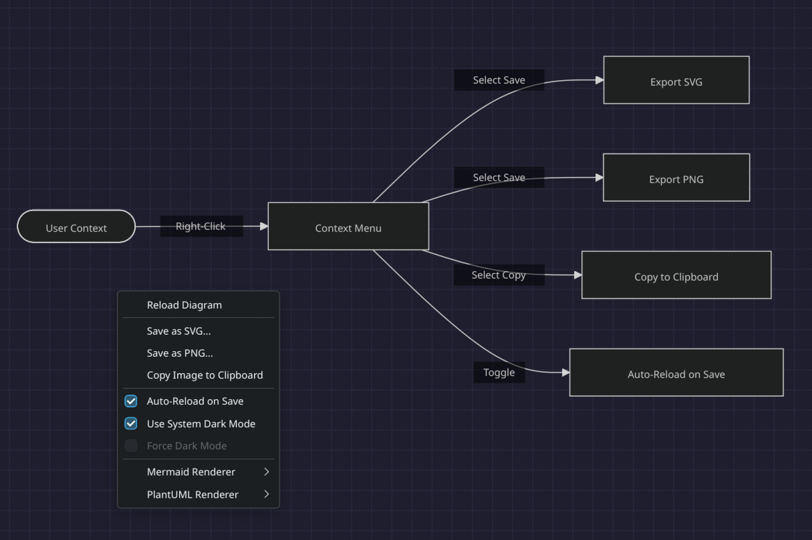
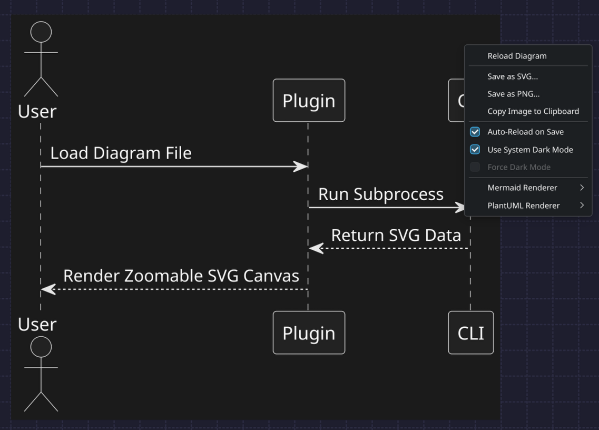

# Unified Diagram Lister Plugin for Double Commander (Linux/Wayland)

A unified WLX (Lister) plugin for Double Commander built with Qt6 to visualize **Mermaid** (`.mmd` / `.mermaid`) and **PlantUML** (`.puml` / `.plantuml`) files as interactive vector diagrams.

By configurations and CLI subprocesses, it parses text files to SVG format and displays them natively using the Qt Graphics View Framework. This SVG-first approach avoids heavy Chromium processes (`QWebEngineView`), resulting in a fast, lightweight, and stable plugin.

---

## Screenshots

### Mermaid Diagram Render


### PlantUML Diagram Render


---

## Features

- **Format Support**: Automatically detects and loads Mermaid and PlantUML files.
- **Interactive Panning and Zooming**:
  - Click and drag to pan around large diagrams.
  - Mouse wheel scroll zoom that anchors automatically under your mouse cursor.
  - Crisp rendering at any zoom level due to native SVG vector display.
- **File Watching & Auto-Reload**:
  - Automatically monitors the current diagram file using `QFileSystemWatcher`.
  - Re-renders instantly when edits are saved in an external editor. Includes a debounced timer (200ms) to support editors using atomic temp-rename saving.
- **Right-Click Context Menu Options**:
  - **Reload Diagram**: Manually reload the active file.
  - **Save as SVG...**: Export the generated diagram to a `.svg` file.
  - **Save as PNG...**: Rasterize the SVG at high quality and save to a `.png` file.
  - **Copy Image to Clipboard**: Copy the rasterized image directly to your system clipboard (Wayland/X11 supported).
  - **Auto-Reload on Save** (Toggle): Enable or disable automated reloading.
  - **Use System Dark Mode** (Toggle): Match plugin palette style with system theme automatically.
  - **Force Dark Mode** (Toggle): Manually override light/dark theme.
  - **Renderer Options**: Choose between local command-line rendering or online web API fallback.

---

## Requirements

### Local Render Mode (Default & Offline)

For local rendering, the plugin invokes command-line subprocesses:
1. **Mermaid**: Requires `mmdc` (from `@mermaid-js/mermaid-cli`) or `npx` to be installed and available on system `$PATH`.
2. **PlantUML**: Requires `java` (JRE) and `plantuml.jar`. The plugin looks for `plantuml.jar` in standard Linux paths (e.g. `/usr/share/java/plantuml/plantuml.jar`) or in Double Commander's config/plugin directory.

### Web Render Mode (Online Fallback)

If local tools are not present or you choose Web mode:
- **Mermaid**: Renders online using `https://mermaid.ink`.
- **PlantUML**: Renders online using `http://www.plantuml.com/plantuml`.

---

## Installation

1. Switch to the `diagramview` branch and run `./build.sh` to compile the plugin.
2. The binary `diagramview_qt6.wlx` will be built under `release/wlx/diagramview/`.
3. In Double Commander, open **Options** -> **Plugins** -> **WLX**.
4. Click **Add** and select `/path/to/diagramview_qt6.wlx`.
5. Double Commander will register the extension string. Ensure the detect string is configured as:
   ```
   (EXT="PUML" | EXT="PLANTUML" | EXT="MMD" | EXT="MERMAID")
   ```

---

## Configuration

The plugin settings are stored in `j2969719.ini` inside the Double Commander configuration directory. You can tweak parameters such as render timeouts, local command paths, and default themes under the `[diagramview]` section.
