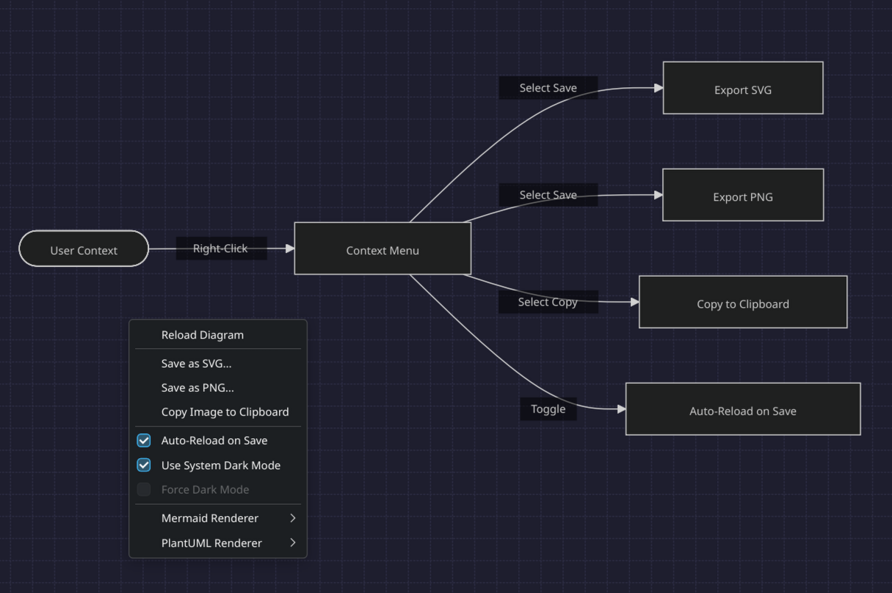
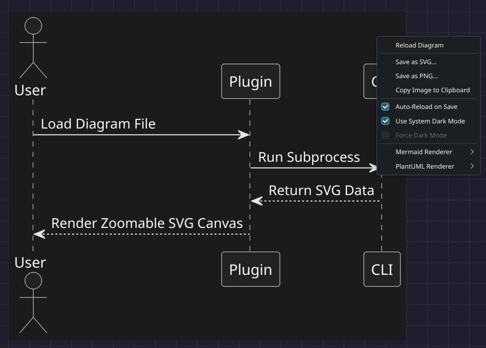

# Unified Diagram Lister Plugin for Double Commander (Linux/Wayland)

A unified WLX (Lister) plugin for Double Commander to visualize **Mermaid** (`.mmd` / `.mermaid`) and **PlantUML** (`.puml` / `.plantuml`) files as interactive vector diagrams.

By configuration and CLI subprocesses, it parses text files to SVG format and displays them natively. This SVG-first approach avoids heavy browser-engine widgets, resulting in a fast, lightweight, and stable plugin.

This plugin ships as **two independent native builds** — one for DC's **GTK3** build, one for its **Qt6** build. They share the same rendering core (`src/core/DiagramRenderer.*` — the CLI subprocess invocation, web-fallback rendering, settings, and dark-mode SVG post-processing) and have equivalent feature sets end to end; only the SVG display widget differs (see [Implementation Notes](#implementation-notes-gtk3-vs-qt6)). Install whichever one matches your Double Commander build — they cannot be mixed.

---

## Screenshots (Qt6 variant)

### Mermaid Diagram Render


### PlantUML Diagram Render


---

## Features (both variants)

- **Format Support**: Automatically detects and loads Mermaid and PlantUML files.
- **Interactive Panning and Zooming**:
  - Click and drag to pan around large diagrams.
  - Mouse wheel scroll zoom that anchors automatically under your mouse cursor.
  - Crisp rendering at any zoom level due to native SVG vector display.
- **File Watching & Auto-Reload**:
  - Automatically monitors the current diagram file for changes.
  - Re-renders instantly when edits are saved in an external editor. Includes a debounced timer (200ms) to support editors using atomic temp-rename saving.
- **Right-Click Context Menu Options**:
  - **Reload Diagram**: Manually reload the active file.
  - **Save as SVG...**: Export the generated diagram to a `.svg` file.
  - **Save as PNG...**: Rasterize the SVG at high quality and save to a `.png` file.
  - **Copy Image to Clipboard**: Copy the rasterized image directly to your system clipboard (Wayland/X11 supported).
  - **Auto-Reload on Save** (Toggle): Enable or disable automated reloading.
  - **Use System Dark Mode** (Toggle): Match plugin palette style with system theme automatically.
  - **Force Dark Mode** (Toggle): Manually override light/dark theme.
  - **Renderer Options**: Choose between local command-line rendering or online web API fallback, independently for Mermaid and PlantUML.

---

## Implementation Notes (GTK3 vs Qt6)

No functional feature gaps between the two variants — every context-menu action, renderer option, and theme toggle above works identically on both. The only real difference is the display widget each toolkit uses to rasterize/render the generated SVG:

| | GTK3 | Qt6 |
|---|---|---|
| SVG display | `librsvg` + Cairo, drawn onto a `GtkDrawingArea` | `QSvgRenderer` inside a `QGraphicsView` |

---

## Requirements

### Local Render Mode (Default & Offline)

For local rendering, the plugin invokes command-line subprocesses:
1. **Mermaid**: Requires `mmdc` (from `@mermaid-js/mermaid-cli`) or `npx` to be installed and available on system `$PATH`.
2. **PlantUML**: Requires `java` (JRE) and `plantuml.jar`. The plugin looks for `plantuml.jar` in standard Linux paths (e.g. `/usr/share/java/plantuml/plantuml.jar`) or in Double Commander's config/plugin directory.

### Web Render Mode (Online Fallback)

If local tools are not present or you choose Web mode:
- **Mermaid**: Renders online using `https://mermaid.ink`.
- **PlantUML**: Renders online using `http://www.plantuml.com/plantuml`.

---

## Building and Installation

### Prerequisites (both variants)
* CMake 3.16+
* C++17 compiler
* `java` runtime + `plantuml.jar` and/or `mmdc`/`npx` on `$PATH`, for local rendering (optional — web fallback works without them)

### GTK3 variant

Additional prerequisites: GTK3 (`gtk+-3.0`), `librsvg-2.0`, `cairo` development packages.

```bash
cd wlx/diagramview
mkdir build && cd build
cmake -DCMAKE_BUILD_TYPE=Release ..
make -j$(nproc) diagramview_gtk3
```

Output: `diagramview_gtk3.wlx`

### Qt6 variant

Additional prerequisites: Qt6 Development Libraries (`Qt6Core`, `Qt6Gui`, `Qt6Widgets`, `Qt6Svg`).

```bash
cd wlx/diagramview
mkdir build && cd build
cmake -DCMAKE_BUILD_TYPE=Release ..
make -j$(nproc) diagramview_qt6
```

Output: `diagramview_qt6.wlx`

### Installation

1. In Double Commander, open **Options** -> **Plugins** -> **WLX**.
2. Click **Add** and select the `.wlx` file matching your DC build (`diagramview_gtk3.wlx` or `diagramview_qt6.wlx`).
3. Ensure the detect string is configured as:
   ```
   (EXT="PUML" | EXT="PLANTUML" | EXT="MMD" | EXT="MERMAID")
   ```

---

## Configuration

Both variants store their settings identically — as `diagramview.ini`, in the directory Double Commander hands the plugin at load time (its `DefaultIniName`), under the `[diagramview]` section. You can tweak parameters such as render timeouts, local command paths, and default themes there.
