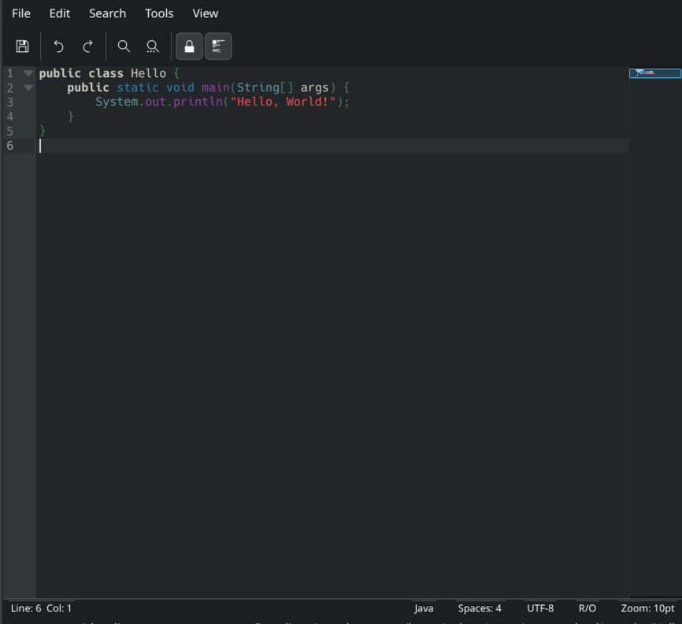
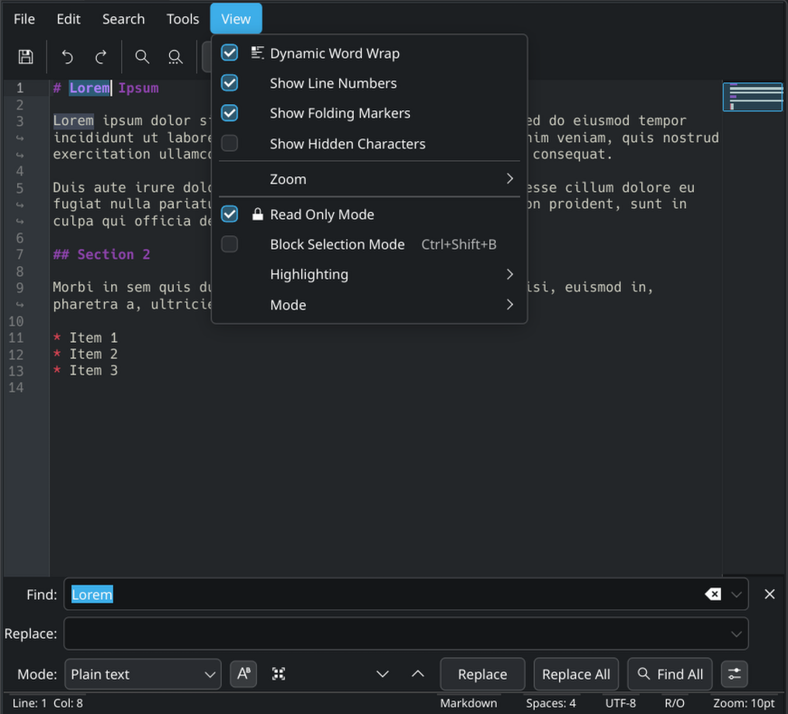
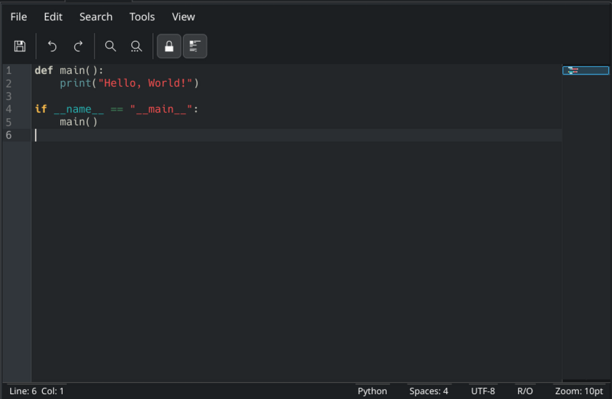

# kate_qt6 — KTextEditor-based Text Editor Plugin

A WLX (Lister) plugin for [Double Commander](https://doublecmd.github.io/) that opens files as a full, editable text editor in the Quick View panel, powered by native Qt6 and KDE's `KTextEditor` framework (the same editing component behind KDE's Kate and KWrite). It's not a read-only viewer — it edits any text file, and syntax highlighting is one feature of that editor, applied automatically via `KSyntaxHighlighting` for languages it recognizes.





This is the Qt6/KDE counterpart to [sourceview](../sourceview/README.md) (which does the same job on the GTK3 build of Double Commander via `GtkSourceView 4`) — same overall design, but the two are independent implementations on different toolkits, so their exact feature sets differ; see below for what this plugin specifically supports, courtesy of `KTextEditor`'s deeper feature set.

## Features
- Full read/write editing of any text file, not just recognized source code — syntax highlighting is layered on top via `KSyntaxHighlighting` when the file's language is recognized, but plain text files open and edit the same way.
- Syntax highlighting for every language `KSyntaxHighlighting` ships a definition for, with a picker to force a specific highlighting mode.
- Save, Save As, Save As with Encoding, Save Copy As (write a copy without changing the open file's tracked encoding), Reload, and an encoding picker for re-opening under a different charset.
- Undo/Redo, Cut/Copy/Paste, Select All, Find/Replace, and Go to Line.
- Code folding markers, toggleable independently of line numbers.
- Block (vertical/column) selection mode.
- An extensive case-conversion suite: UPPERCASE, lowercase, Title Case, Proper case, Sentence case, camelCase, PascalCase, snake_case, SCREAMING_SNAKE_CASE, kebab-case, SCREAMING-KEBAB-CASE, dot.case, and path/case.
- Line-ending conversion: Windows (CRLF), Linux (LF), MacOS (CR).
- Sort Lines, and trim trailing/leading whitespace.
- Dynamic word wrap, line numbers, and a toggle to show non-printing/hidden characters.
- Zoom in/out/reset on the editor font.
- Editing-mode picker (`tools_mode`) in addition to the syntax-highlighting picker.
- Disk-change notification bar: when the open file changes on disk outside the editor, a bar offers Enable Auto Reload, View Difference, Reload, or Ignore.
- Toolbar with Save, Save As, Undo, Redo, Print, Find, Replace, Read-Only toggle, and Word Wrap toggle.
- Comprehensive status bar: cursor position, encoding, syntax mode, indentation, editing mode, and zoom level.
- Printing support.

## Requirements
- `Qt6` (Core, Gui, Widgets)
- `KF6TextEditor` (KDE Frameworks 6)

## Building
```bash
mkdir build && cd build
cmake ..
make
```

## Installation
Copy `kate_qt6.wlx` to `~/.config/doublecmd/plugins/wlx/` and add it via Double Commander's Options -> Plugins -> WLX.
