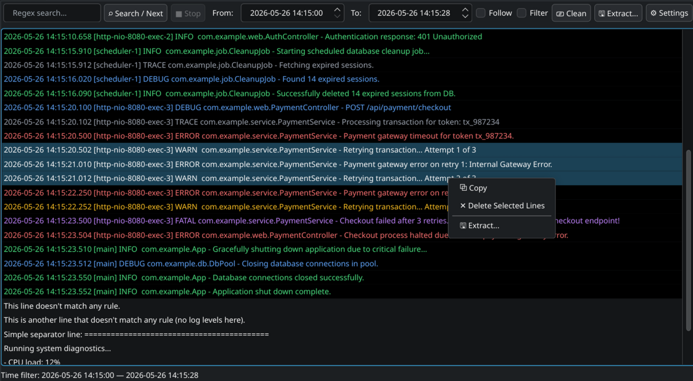
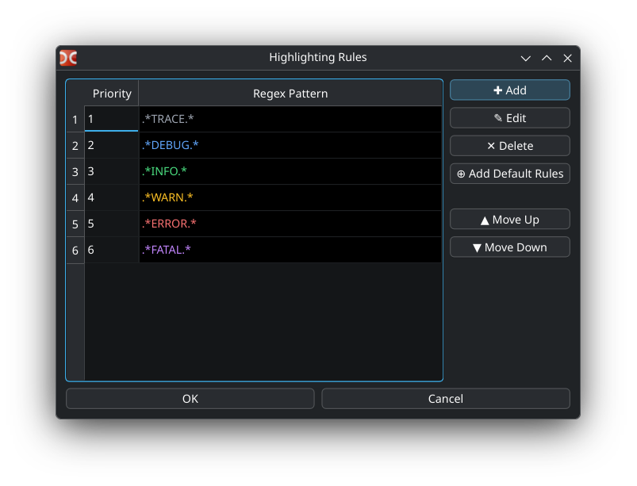

# WLX Log Viewer Plugin for Double Commander

A high-performance, Wayland-compatible WLX (Lister) log viewer plugin for Double Commander. Designed to handle large log files seamlessly while providing fast searching and filtering capabilities without freezing the host application.



This plugin ships as **two independent native builds** — one for DC's **GTK3** build, one for its **Qt6** build. Both share the same `mmap`-backed `LogEngine` core (`src/core/`) and have equivalent search, filter, follow, highlight-rules, and line-management features. The main real difference is architectural: the Qt6 variant carries a Wayland-specific focus-isolation layer that the GTK3 variant doesn't need (see [Feature Differences](#feature-differences-gtk3-vs-qt6)). Install whichever one matches your Double Commander build — they cannot be mixed.

## Features (both variants, unless noted below)

- **Zero-Copy File Loading**: Utilizes `mmap` and line-offset indexing to instantly load massive log files with extremely low memory overhead.
- **Fast Regex Searching**: Powered by Google's `RE2` regex engine, offloaded off the UI thread to keep the interface responsive.
- **Timestamp Range Filtering**: Automatically detects and parses common timestamp formats (ISO 8601, nginx, syslog). Allows filtering log lines within a specific date/time range.
- **Live Tailing (Follow Mode)**: Monitors the file for changes and automatically updates and scrolls to new entries.
- **Advanced Filtering**: Combines regex matches and timestamp ranges efficiently.
- **Native Interactions**: Supports standard file manager interactions, including multi-row selection (Ctrl+click, Shift+click) and copying (Ctrl+C).
- **Context menu**: Copy or delete selected lines.
- **Clear log file**: remove all log entries.
- **Extract selected lines** to another file.
- **Regex-based Color Highlighting**:
  - Allows mapping regular expression patterns to custom foreground and background colors to visually distinguish log levels and components.
  - Configurable settings modal with a priority-sorted data grid representing patterns directly in their chosen styles. Supports double-clicking a row to edit.
  - Full support for multi-selection actions to delete, move up, or move down multiple rules at once.
  - Pre-packaged **Add Default Rules** button to instantly insert standard diagnostics highlights (`TRACE`, `DEBUG`, `INFO`, `WARN`, `ERROR`, `FATAL`) relative to your current selection.
  - Persists configurations across sessions by saving the rule list to `logview.ini`'s `[HighlightRules]` section.



## Feature Differences (GTK3 vs Qt6)

| | GTK3 | Qt6 |
|---|---|---|
| Live tailing mechanism | Once-a-second poll timer | `QFileSystemWatcher` (inotify-based) |
| Wayland focus-isolation architecture | **Not applicable** — GTK3's embedding model doesn't exhibit the same focus-hijacking behavior, so none of the layers below exist in this variant | A 4-layer focus defense (see below), specifically working around Wayland focus-hijacking bugs from embedding Qt components into DC's Lazarus host process |

Everything else — mmap-backed loading, regex search/filter, timestamp filtering, follow mode, context menu (copy/delete/extract/clear), and the highlight-rules editor with its default-rules button — is implemented equivalently in both variants via the shared `LogEngine` core.

### Qt6-only: Wayland Focus Isolation

Implements a 4-layer focus defense architecture to resolve Wayland focus-hijacking bugs typical when embedding Qt components into Lazarus applications:
- **Layer 0**: Deferred `show()` execution to prevent the plugin from trapping the host's `MouseRelease` event (fixes the "phantom-drag" issue).
- **Layer 1**: Aggressive `Qt::NoFocus` policy applied to the base container.
- **Layer 2**: Recursive focus guard that strips focus capabilities from all non-input child widgets.
- **Layer 3**: Cross-load focus preservation (saves the currently focused Double Commander widget state and restores it after loading completes).
- **Layer 4**: Global `FocusIn` event interceptor that immediately yanks stolen focus back to Double Commander, unless an input field is explicitly clicked by the user.

## Dependencies

### Both variants
- C++20 compatible compiler (GCC or Clang)
- CMake (3.16 or higher)
- **RE2** regular expression library (`libre2-dev` on Debian/Ubuntu)

### GTK3 variant
- GTK3 (`gtk+-3.0`) development packages

### Qt6 variant
- Qt 6 development packages (Core, Gui, Widgets)

## Build Instructions

### GTK3 variant

```bash
cd wlx/logview
mkdir build && cd build
cmake ..
make -j$(nproc) logviewer_gtk3
```

Output: `logviewer_gtk3.wlx`

### Qt6 variant

```bash
cd wlx/logview
mkdir build && cd build
cmake ..
make -j$(nproc) logviewer
```

Output: `logviewer.wlx`

### Installation

```bash
cp logviewer_gtk3.wlx ~/.config/doublecmd/plugins/wlx/   # GTK3 build of DC
# or
cp logviewer.wlx ~/.config/doublecmd/plugins/wlx/         # Qt6 build of DC
```

## Installation in Double Commander

1. Open Double Commander.
2. Go to **Configuration** > **Options** > **Plugins** > **WLX (Lister)**.
3. Click **Add** and select the `.wlx` file matching your DC build.
4. The plugin automatically registers the following extensions: `.log`, `.out`, `.err`, `.ndjson`, `.jsonl`, `.1`, `.2`, and `.old`. You can adjust this "Detect string" in Double Commander's options if you want it to automatically trigger on other extensions.
5. Apply and close. Select a log file and press `F3` or `Ctrl+Q` (Quick View) to use. For files without an extension (like `/var/log/syslog`), select the file and press `F3`.

## Configuration

Both variants store their settings identically — as `logview.ini`, in the directory Double Commander hands the plugin at load time (its `DefaultIniName`).
